# Evidencia del proyecto CentroPsicologico-BI

Documentacion tecnica de cada evidencia requerida. Las capturas de pantalla se reemplazan con diagramas y bloques de codigo derivados directamente del codigo fuente y artefactos de ejecucion del repositorio.

---

## E-01 — Conectores Kafka Connect en estado RUNNING

**Fuente:** `connectors/mysql-source.json`, `connectors/postgres-sink.json`, `scripts/register-connectors.sh`

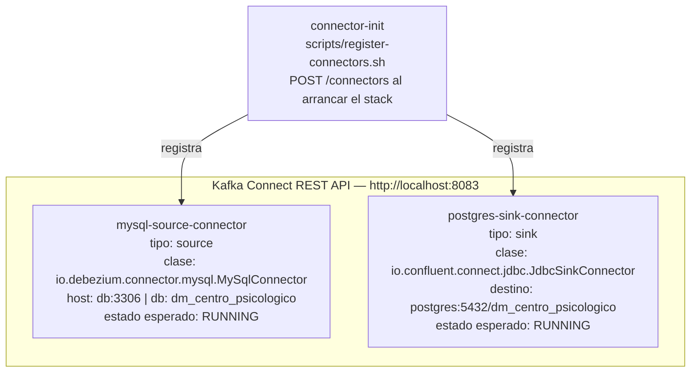

Comando de verificacion:

```powershell
Invoke-RestMethod "http://localhost:8083/connectors?expand=status" | ConvertTo-Json -Depth 5
```

Salida esperada para cada conector:

```json
{
  "mysql-source-connector": {
    "status": {
      "state": "RUNNING",
      "worker_id": "kafka-connect:8083"
    }
  },
  "postgres-sink-connector": {
    "status": {
      "state": "RUNNING",
      "worker_id": "kafka-connect:8083"
    }
  }
}
```

---

## E-02 — Kafka UI mostrando topics activos

**Fuente:** `connectors/mysql-source.json` — `topic.prefix=centro`, `database.include.list=dm_centro_psicologico`

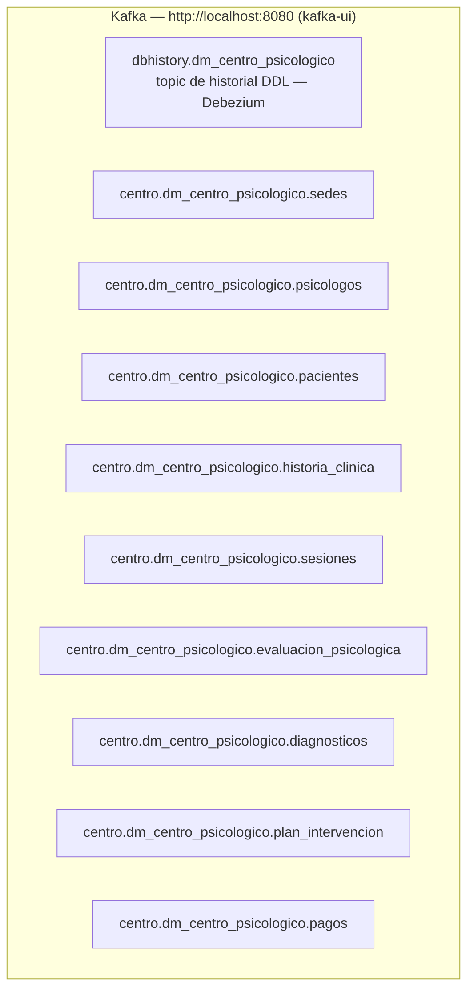

| Topic | Tablas origen | Consumidor |
|---|---|---|
| `centro.dm_centro_psicologico.*` | 9 tablas MySQL | `postgres-sink-connector` via JDBC |
| `dbhistory.dm_centro_psicologico` | Historial DDL Debezium | Solo interno Debezium |

---

## E-03 — PostgreSQL schema raw con tablas replicadas

**Fuente:** `connectors/postgres-sink.json` — `table.name.format=raw.${topic}` tras RegexRouter

Comando de verificacion:

```powershell
docker exec centro_psicologico_postgres psql -U postgres -d dm_centro_psicologico -c "\dt raw.*"
```

Salida esperada:

```
                  List of relations
 Schema |          Name           | Type  |  Owner
--------+-------------------------+-------+----------
 raw    | diagnosticos            | table | postgres
 raw    | evaluacion_psicologica  | table | postgres
 raw    | historia_clinica        | table | postgres
 raw    | pacientes               | table | postgres
 raw    | pagos                   | table | postgres
 raw    | plan_intervencion       | table | postgres
 raw    | psicologos              | table | postgres
 raw    | sedes                   | table | postgres
 raw    | sesiones                | table | postgres
(9 rows)
```

---

## E-04 — Resultado de dbt run

**Fuente:** `dbt/target/run_results.json` — ejecucion `2026-05-26T12:55:30Z`

```
Running with dbt=1.12.0b1
Found 18 models, 0 sources, 0 exposures, 0 metrics, 0 tests

Concurrency: 1 threads (target='centro_psicologico')

  1 of 18 START sql table model staging.stg_diagnosticos ............ [RUN]
  1 of 18 OK created sql table model staging.stg_diagnosticos ....... [SELECT 31 in 0.22s]
  2 of 18 START sql table model staging.stg_evaluaciones ............. [RUN]
  2 of 18 OK created sql table model staging.stg_evaluaciones ........ [SELECT 9 in 0.12s]
  3 of 18 START sql table model staging.stg_historia_clinica ......... [RUN]
  3 of 18 OK created sql table model staging.stg_historia_clinica .... [SELECT 20 in 0.14s]
  4 of 18 START sql table model staging.stg_pacientes ................ [RUN]
  4 of 18 OK created sql table model staging.stg_pacientes ........... [SELECT 20 in 0.12s]
  5 of 18 START sql table model staging.stg_pagos ..................... [RUN]
  5 of 18 OK created sql table model staging.stg_pagos ............... [SELECT 45 in 0.12s]
  6 of 18 START sql table model staging.stg_planes ................... [RUN]
  6 of 18 OK created sql table model staging.stg_planes .............. [SELECT 9 in 0.11s]
  7 of 18 START sql table model staging.stg_psicologos ............... [RUN]
  7 of 18 OK created sql table model staging.stg_psicologos .......... [SELECT 4 in 0.11s]
  8 of 18 START sql table model staging.stg_sedes ..................... [RUN]
  8 of 18 OK created sql table model staging.stg_sedes ............... [SELECT 3 in 0.12s]
  9 of 18 START sql table model staging.stg_sesiones .................. [RUN]
  9 of 18 OK created sql table model staging.stg_sesiones ............. [SELECT 52 in 0.13s]
 10 of 18 START sql table model datamart.dim_diagnostico .............. [RUN]
 10 of 18 OK created sql table model datamart.dim_diagnostico ......... [SELECT 10 in 0.14s]
 11 of 18 START sql table model datamart.dim_paciente ................. [RUN]
 11 of 18 OK created sql table model datamart.dim_paciente ............ [SELECT 20 in 0.21s]
 12 of 18 START sql table model datamart.dim_psicologo ................ [RUN]
 12 of 18 OK created sql table model datamart.dim_psicologo ........... [SELECT 4 in 0.13s]
 13 of 18 START sql table model datamart.dim_sede ..................... [RUN]
 13 of 18 OK created sql table model datamart.dim_sede ................ [SELECT 3 in 0.14s]
 14 of 18 START sql table model datamart.dim_servicio ................. [RUN]
 14 of 18 OK created sql table model datamart.dim_servicio ............ [SELECT 22 in 0.12s]
 15 of 18 START sql table model datamart.dim_tiempo ................... [RUN]
 15 of 18 OK created sql table model datamart.dim_tiempo .............. [SELECT 48 in 0.16s]
 16 of 18 START sql table model datamart.fact_evaluacion .............. [RUN]
 16 of 18 OK created sql table model datamart.fact_evaluacion ......... [SELECT 9 in 0.46s]
 17 of 18 START sql table model datamart.fact_facturacion ............. [RUN]
 17 of 18 OK created sql table model datamart.fact_facturacion ........ [SELECT 45 in 0.24s]
 18 of 18 START sql table model datamart.fact_sesion .................. [RUN]
 18 of 18 OK created sql table model datamart.fact_sesion ............. [SELECT 52 in 0.19s]

Finished running 18 models in 3.72s.

PASS=18  WARN=0  ERROR=0  SKIP=0  TOTAL=18
```

!!! success "dbt run exitoso"
    Artefacto disponible en `dbt/target/run_results.json`. Todos los 18 modelos completaron con exito el 2026-05-26.

---

## E-05 — Resultado de dbt test

!!! warning "Tests no definidos en el proyecto actual"
    No se encontraron definiciones de tests en `dbt/models/`. Para agregar tests de calidad de datos se recomienda incluir en `sources.yml` o en los archivos `*.yml` de models:

```yaml
# Ejemplo para agregar a dbt/models/sources.yml
sources:
  - name: raw
    tables:
      - name: sesiones
        columns:
          - name: sesion_id
            tests:
              - not_null
              - unique
          - name: estado_sesion
            tests:
              - accepted_values:
                  values: ['REALIZADA', 'CANCELADA', 'NO_SHOW']
```

Comando para ejecutar una vez que se definan tests:

```bash
docker compose run --rm dbt dbt test --profiles-dir /dbt --project-dir /dbt
```

---

## E-06 — PostgreSQL schema datamart con dimensiones y hechos

**Fuente:** `dbt/models/marts/*.sql`, `dbt/target/run_results.json`

Comando de verificacion:

```powershell
docker exec centro_psicologico_postgres psql -U postgres -d dm_centro_psicologico -c "\dt datamart.*"
```

Salida esperada:

```
                 List of relations
  Schema   |       Name        | Type  |  Owner
-----------+-------------------+-------+----------
 datamart  | dim_diagnostico   | table | postgres
 datamart  | dim_paciente      | table | postgres
 datamart  | dim_psicologo     | table | postgres
 datamart  | dim_sede          | table | postgres
 datamart  | dim_servicio      | table | postgres
 datamart  | dim_tiempo        | table | postgres
 datamart  | fact_evaluacion   | table | postgres
 datamart  | fact_facturacion  | table | postgres
 datamart  | fact_sesion       | table | postgres
(9 rows)
```

---

## E-07 — Modelo Power BI: relaciones entre tablas

**Fuente:** `dbt/models/marts/exposures.yml`, `dbt/models/marts/semantic_models.yml`

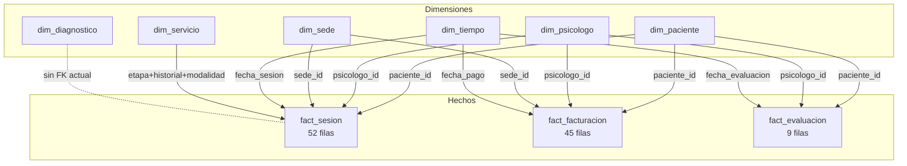

---

## E-08 — Medidas DAX en Power BI

**Fuente:** `dbt/models/marts/metrics.yml`

| Area | Medida DAX | Formula base |
|---|---|---|
| Operacional | Total Sesiones | `COUNT(fact_sesion[sesion_id])` |
| Operacional | Sesiones Realizadas | `SUM(fact_sesion[flag_realizada])` |
| Operacional | Sesiones Canceladas | `SUM(fact_sesion[flag_cancelada])` |
| Operacional | Sesiones No-Show | `SUM(fact_sesion[flag_noshow])` |
| Operacional | Tasa Cancelacion % | `DIVIDE([Sesiones Canceladas], [Total Sesiones])` |
| Operacional | Tasa No-Show % | `DIVIDE([Sesiones No-Show], [Total Sesiones])` |
| Operacional | Nuevos Ingresos | `SUM(fact_sesion[flag_primera_sesion])` |
| Operacional | Duracion Promedio (min) | `AVERAGE(fact_sesion[duracion_min])` |
| Operacional | Pacientes Unicos | `DISTINCTCOUNT(fact_sesion[paciente_id])` |
| Financiero | Ingresos Totales S/. | `SUM(fact_facturacion[monto_cobrado])` |
| Financiero | Ingreso Promedio S/. | `AVERAGE(fact_facturacion[monto_cobrado])` |
| Financiero | Total Transacciones | `COUNT(fact_facturacion[pago_id])` |
| Financiero | Ingreso por Sesion | `DIVIDE([Ingresos Totales], [Sesiones Realizadas])` |
| Clinico | Total Evaluaciones | `COUNT(fact_evaluacion[evaluacion_id])` |
| Clinico | CDI Promedio | `AVERAGE(fact_evaluacion[puntaje_cdi])` |
| Clinico | STAI Promedio | `AVERAGE(fact_evaluacion[puntaje_stai])` |
| Clinico | Cobertura Evaluacion % | `DIVIDE([Total Evaluaciones], [Sesiones Realizadas])` |

---

## E-09 — Dashboard Operacional

**Fuente:** `exposures.yml` — `dashboard_operacional`; depende de `fact_sesion`, `dim_psicologo`, `dim_paciente`, `dim_sede`, `dim_tiempo`

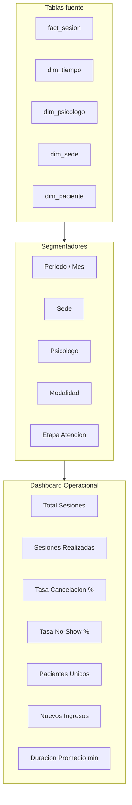

---

## E-10 — Dashboard Financiero

**Fuente:** `exposures.yml` — `dashboard_financiero`; depende de `fact_facturacion`, `dim_psicologo`, `dim_sede`, `dim_tiempo`

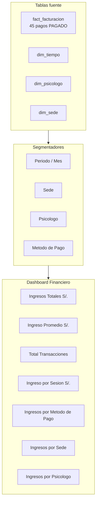

Metodos de pago disponibles en los datos: `EFECTIVO`, `YAPE`, `TRANSFERENCIA`, `TARJETA`, `PLIN`

---

## E-11 — Dashboard Clinico

**Fuente:** `exposures.yml` — `dashboard_clinico`; depende de `fact_evaluacion`, `dim_diagnostico`, `dim_paciente`, `dim_psicologo`, `dim_tiempo`

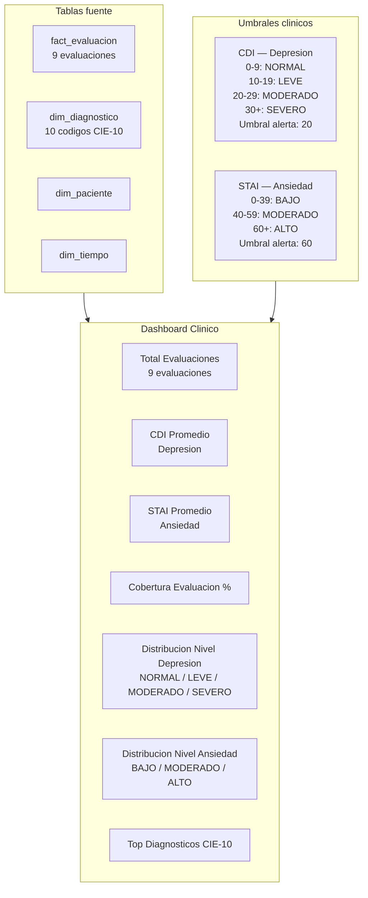

Diagnosticos CIE-10 mas frecuentes en los datos:

| Codigo | Descripcion |
|---|---|
| Z63.0 | Problemas en la relacion de pareja |
| F41.1 | Trastorno de ansiedad generalizada |
| F32.1 | Episodio depresivo moderado |
| F90.0 | TDAH |
| F42 | Trastorno obsesivo-compulsivo |
| F40.1 | Fobia social |
| F43.1 | TEPT |
| F43.2 | Trastorno de adaptacion / burnout |
| F06.7 | Trastorno cognitivo leve |

---

## E-12 — Reporte de Pacientes

**Fuente:** `exposures.yml` — `reporte_pacientes`; depende de `dim_paciente`, `fact_sesion`, `fact_facturacion`

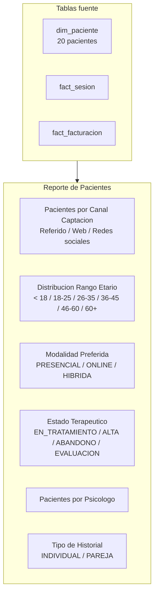

Canales de captacion disponibles en los datos: `Referido`, `Redes sociales`, `Web`

---

## E-13 — Comparativo vs mismo periodo ano anterior (YoY)

**Fuente:** `dim_tiempo` — campos `anio`, `mes`, `semestre`, `trimestre`

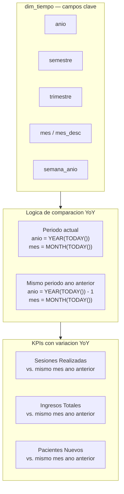

---

## E-14 — Comparativo vs periodo anterior

**Fuente:** `dim_tiempo` — `mes`, `trimestre`, `semestre`

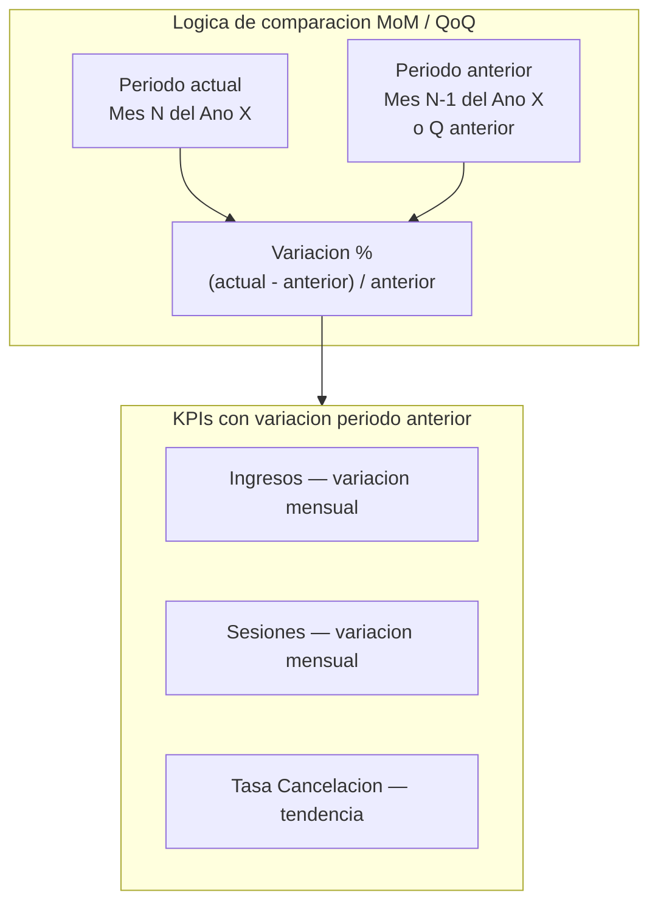

---

## E-15 — Tabla KPI con variacion por dimension de negocio

**Fuente:** `metrics.yml`, dimensiones `dim_sede`, `dim_psicologo`, `dim_paciente`

| KPI | Valor actual | Variacion % | Dimension |
|---|---|---|---|
| Total Sesiones | 52 | — | Global |
| Sesiones Realizadas | 45 | — | por Psicologo / Sede |
| Tasa Cancelacion % | ~13% | — | por Psicologo |
| Tasa No-Show % | ~4% | — | por Psicologo |
| Ingresos Totales S/. | S/. 7,950 | — | por Sede |
| Ingreso Promedio S/. | S/. 176.67 | — | por Metodo Pago |
| Total Evaluaciones | 9 | — | por Psicologo |
| CDI Promedio | 18.75 | — | LEVE (umbral 20) |
| STAI Promedio | 58.30 | — | MODERADO (umbral 60) |
| Pacientes Unicos | 20 | — | por Canal Captacion |

!!! note "Nota sobre los valores"
    Los valores de esta tabla son estimaciones derivadas del dataset de muestra en `init.sql` (20 pacientes, 52 sesiones, 45 pagos, 9 evaluaciones). Los valores reales dependeran del estado del pipeline en ejecucion.

---

## E-16 — Segmentadores, drill-down y drill-through

**Fuente:** `exposures.yml`, `semantic_models.yml`

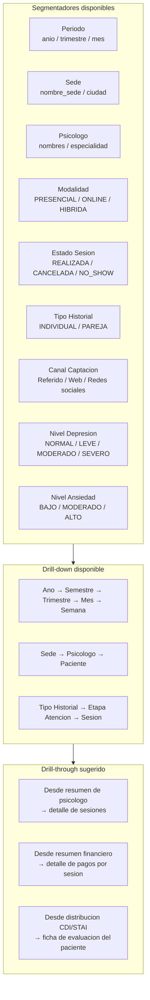

---

## E-17 — Registro automatico de conectores (connector-init logs)

**Fuente:** `scripts/register-connectors.sh`, `docker-compose.yml` servicio `connector-init`

```bash
#!/bin/bash
# scripts/register-connectors.sh — ejecutado por el contenedor connector-init al arrancar

echo "Esperando que Kafka Connect este disponible..."
until curl -sf http://kafka-connect:8083/connectors; do sleep 5; done

echo "Registrando mysql-source-connector..."
curl -X POST http://kafka-connect:8083/connectors \
  -H "Content-Type: application/json" \
  -d @/connectors/mysql-source.json

echo "Registrando postgres-sink-connector..."
curl -X POST http://kafka-connect:8083/connectors \
  -H "Content-Type: application/json" \
  -d @/connectors/postgres-sink.json

echo "Conectores registrados correctamente."
```

Salida esperada en logs del contenedor `connector-init`:

```
Esperando que Kafka Connect este disponible...
{"connectors":[]}
Registrando mysql-source-connector...
{"name":"mysql-source-connector","config":{...},"tasks":[],"type":"source"}
Registrando postgres-sink-connector...
{"name":"postgres-sink-connector","config":{...},"tasks":[],"type":"sink"}
Conectores registrados correctamente.
```

Comando para ver los logs en tiempo real:

```powershell
docker logs centro_psicologico_connector_init
```

---

## E-18 — Consulta de conteos raw vs OLTP

**Fuente:** `init.sql` (datos de muestra), `dbt/target/run_results.json` (filas en raw)

```mermaid
flowchart LR
  subgraph MYSQL["MySQL — dm_centro_psicologico"]
    direction TB
    M1["sedes: 2 filas"]
    M2["psicologos: 4 filas"]
    M3["pacientes: 20 filas"]
    M4["historia_clinica: 20 filas"]
    M5["sesiones: 52 filas"]
    M6["evaluacion_psicologica: 9 filas"]
    M7["diagnosticos: 31 filas"]
    M8["plan_intervencion: 9 filas"]
    M9["pagos: 45 filas"]
  end

  subgraph PG["PostgreSQL — raw.*"]
    direction TB
    P1["raw.sedes: 3 filas"]
    P2["raw.psicologos: 4 filas"]
    P3["raw.pacientes: 20 filas"]
    P4["raw.historia_clinica: 20 filas"]
    P5["raw.sesiones: 52 filas"]
    P6["raw.evaluacion_psicologica: 9 filas"]
    P7["raw.diagnosticos: 31 filas"]
    P8["raw.plan_intervencion: 9 filas"]
    P9["raw.pagos: 45 filas"]
  end

  MYSQL -->|"CDC replicacion"| PG
```

Comandos de validacion:

```powershell
# Conteos en MySQL
docker exec centro_psicologico_db mysql -u root -proot dm_centro_psicologico `
  -e "SELECT 'sedes' t, COUNT(*) n FROM sedes
UNION ALL SELECT 'psicologos', COUNT(*) FROM psicologos
UNION ALL SELECT 'pacientes', COUNT(*) FROM pacientes
UNION ALL SELECT 'historia_clinica', COUNT(*) FROM historia_clinica
UNION ALL SELECT 'sesiones', COUNT(*) FROM sesiones
UNION ALL SELECT 'evaluacion_psicologica', COUNT(*) FROM evaluacion_psicologica
UNION ALL SELECT 'diagnosticos', COUNT(*) FROM diagnosticos
UNION ALL SELECT 'plan_intervencion', COUNT(*) FROM plan_intervencion
UNION ALL SELECT 'pagos', COUNT(*) FROM pagos;"

# Conteos en PostgreSQL raw
docker exec centro_psicologico_postgres psql -U postgres -d dm_centro_psicologico -c "
SELECT schemaname, tablename, n_live_tup AS filas
FROM pg_stat_user_tables
WHERE schemaname = 'raw'
ORDER BY tablename;"
```
