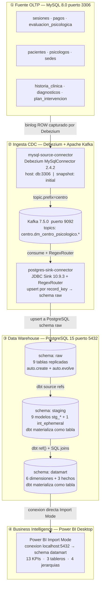
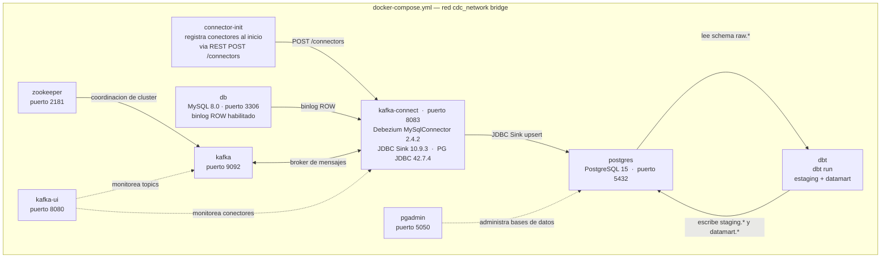

# Arquitectura CDC y BI

## Pipeline completo: MySQL → Kafka → PostgreSQL → dbt → BI

---

## Infraestructura Docker

Todos los servicios corren en la red `cdc_network` definida en `docker-compose.yml`.

---

## Notas de revision

- El compose principal (`docker-compose.yml`) monta `./init.sql` en MySQL; ese DDL crea las tablas `sedes`, `psicologos`, `pacientes`, `historia_clinica`, `sesiones`, `evaluacion_psicologica`, `diagnosticos`, `plan_intervencion` y `pagos`.
- Existe `OLTP_Centro_Psicologico.sql` con un esquema anterior `oltp_*` de 4 tablas que **no** es el DDL cargado por el `docker-compose.yml` principal.
- Los topics individuales no estan enumerados en el JSON del conector; se infieren de `topic.prefix=centro`, `database.include.list=dm_centro_psicologico` y el patron del sink `centro\.dm_centro_psicologico\..*`.
- No se encontro archivo Power BI (`.pbix`, `.pbit`, `.pbip`, `.bim`, `.dax`). Solo existen `exposures.yml`, `metrics.yml` y `semantic_models.yml` que documentan el consumo analitico esperado.
- El servicio `connector-init` ejecuta `scripts/register-connectors.sh` para registrar automaticamente los dos conectores JSON al inicio del stack.
