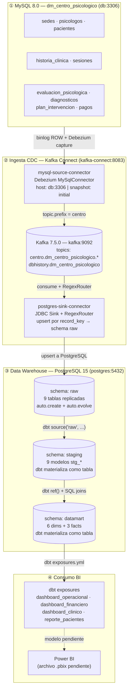
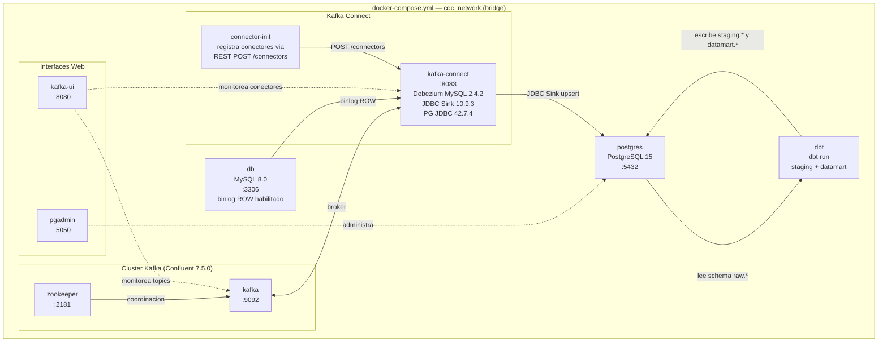

# Arquitectura CDC y BI

## Pipeline completo: MySQL → Kafka → PostgreSQL → dbt → BI

---

## Infraestructura Docker

Todos los servicios corren en la red `cdc_network` definida en `docker-compose.yml`.

---

## Notas de revision

- El compose principal monta `./init.sql` en MySQL; ese DDL crea las 9 tablas del sistema OLTP.
- Los topics individuales se infieren de `topic.prefix=centro`, `database.include.list=dm_centro_psicologico` y el patron del sink `centro\.dm_centro_psicologico\..*`.
- No se encontro archivo Power BI (`.pbix`, `.pbit`, `.pbip`). Solo existen `exposures.yml`, `metrics.yml` y `semantic_models.yml`.
- El servicio `connector-init` ejecuta `scripts/register-connectors.sh` para registrar los dos conectores JSON al inicio del stack.
