# Lineaje dbt

Muestra las dependencias entre capas de modelos dbt: fuentes `raw` → `staging` → dimensiones y hechos del `datamart`.

## Dependencias entre modelos

```mermaid
flowchart TD
  subgraph RAW["schema raw — fuentes CDC (PostgreSQL)"]
    r_sedes([raw.sedes])
    r_psicologos([raw.psicologos])
    r_pacientes([raw.pacientes])
    r_historia([raw.historia_clinica])
    r_sesiones([raw.sesiones])
    r_evaluaciones([raw.evaluacion_psicologica])
    r_diagnosticos([raw.diagnosticos])
    r_planes([raw.plan_intervencion])
    r_pagos([raw.pagos])
  end

  subgraph STAGING["schema staging"]
    stg_sedes[stg_sedes]
    stg_psicologos[stg_psicologos]
    stg_pacientes[stg_pacientes]
    stg_historia[stg_historia_clinica]
    stg_sesiones[stg_sesiones]
    stg_evaluaciones[stg_evaluaciones]
    stg_diagnosticos[stg_diagnosticos]
    stg_planes[stg_planes]
    stg_pagos[stg_pagos]
  end

  subgraph DIMS["schema datamart — dimensiones"]
    dim_sede[dim_sede]
    dim_psicologo[dim_psicologo]
    dim_paciente[dim_paciente]
    dim_tiempo[dim_tiempo]
    dim_servicio[dim_servicio]
    dim_diagnostico[dim_diagnostico]
  end

  subgraph FACTS["schema datamart — hechos"]
    fact_sesion[fact_sesion]
    fact_facturacion[fact_facturacion]
    fact_evaluacion[fact_evaluacion]
  end

  r_sedes --> stg_sedes
  r_psicologos --> stg_psicologos
  r_pacientes --> stg_pacientes
  r_historia --> stg_historia
  r_sesiones --> stg_sesiones
  r_evaluaciones --> stg_evaluaciones
  r_diagnosticos --> stg_diagnosticos
  r_planes --> stg_planes
  r_pagos --> stg_pagos

  stg_sedes --> dim_sede
  stg_psicologos --> dim_psicologo
  stg_pacientes & stg_historia --> dim_paciente
  stg_sesiones --> dim_tiempo
  stg_sesiones & stg_historia --> dim_servicio
  stg_diagnosticos --> dim_diagnostico

  stg_sesiones & stg_historia & stg_psicologos --> fact_sesion
  stg_pagos & stg_sesiones & stg_historia & stg_psicologos --> fact_facturacion
  stg_evaluaciones & stg_sesiones & stg_historia --> fact_evaluacion
```

---

## Transformaciones aplicadas en staging

| Modelo staging | Fuente raw | Transformaciones clave |
|---|---|---|
| `stg_sedes` | `raw.sedes` | Convierte `tiene_online` TINYINT a booleano |
| `stg_psicologos` | `raw.psicologos` | Seleccion directa de columnas |
| `stg_pacientes` | `raw.pacientes` | Convierte `fecha_nacimiento` desde entero Debezium con `DATE '1970-01-01' + campo` |
| `stg_historia_clinica` | `raw.historia_clinica` | Convierte `fecha_apertura` |
| `stg_sesiones` | `raw.sesiones` | Convierte `fecha_sesion`; `coalesce(duracion_min, 0)` |
| `stg_evaluaciones` | `raw.evaluacion_psicologica` | `coalesce` en puntajes CDI/STAI; convierte `fecha_evaluacion` |
| `stg_diagnosticos` | `raw.diagnosticos` | Filtra `codigo_cie10 IS NOT NULL` |
| `stg_planes` | `raw.plan_intervencion` | Convierte `fecha_inicio` y `fecha_fin` |
| `stg_pagos` | `raw.pagos` | Convierte `fecha_pago`; `coalesce(monto, 0.00)` |

## Construccion de marts

| Modelo mart | Tipo | Joins principales |
|---|---|---|
| `dim_paciente` | Dimension | `stg_pacientes` LEFT JOIN `stg_historia_clinica` por `paciente_id` |
| `dim_psicologo` | Dimension | `stg_psicologos` |
| `dim_sede` | Dimension | `stg_sedes` |
| `dim_servicio` | Dimension | `stg_sesiones` LEFT JOIN `stg_historia_clinica` por `historia_id` |
| `dim_tiempo` | Dimension | `stg_sesiones` — genera calendario desde fechas de sesion |
| `dim_diagnostico` | Dimension | `stg_diagnosticos` — `DISTINCT codigo_cie10` |
| `fact_sesion` | Hecho | `stg_sesiones` + historias + psicologos |
| `fact_facturacion` | Hecho | `stg_pagos` + sesiones + historias + psicologos; filtro `estado_pago = 'PAGADO'` |
| `fact_evaluacion` | Hecho | `stg_evaluaciones` + sesiones + historias |
