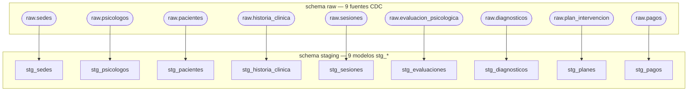
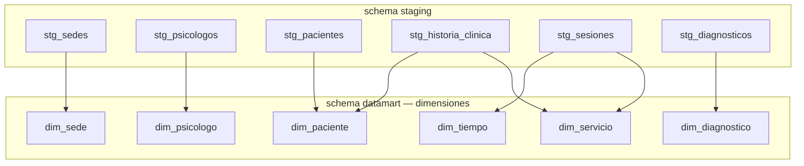
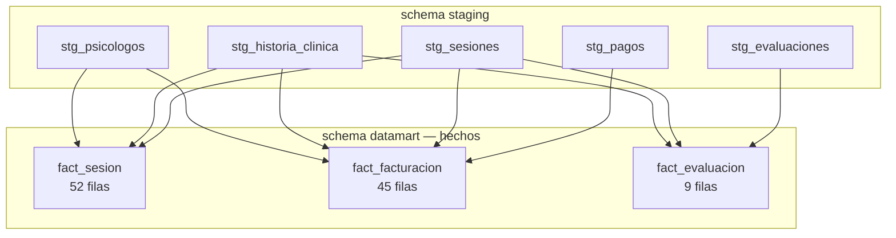

# Lineaje dbt

Dependencias entre capas de modelos dbt: fuentes `raw` → `staging` → dimensiones y hechos del `datamart`.

## Linaje: raw → staging

## Linaje: staging → dimensiones

## Linaje: staging → hechos

---

## Transformaciones aplicadas en staging

| Modelo staging | Filas | Fuente raw | Transformaciones clave |
|---|---|---|---|
| `stg_sedes` | 3 | `raw.sedes` | Convierte `tiene_online` TINYINT → booleano |
| `stg_psicologos` | 4 | `raw.psicologos` | Seleccion directa de columnas |
| `stg_pacientes` | 20 | `raw.pacientes` | `DATE '1970-01-01' + fecha_nacimiento` (entero Debezium → DATE) |
| `stg_historia_clinica` | 20 | `raw.historia_clinica` | Convierte `fecha_apertura` |
| `stg_sesiones` | 52 | `raw.sesiones` | Convierte `fecha_sesion`; `coalesce(duracion_min, 0)` |
| `stg_evaluaciones` | 9 | `raw.evaluacion_psicologica` | `coalesce` en CDI/STAI; convierte `fecha_evaluacion` |
| `stg_diagnosticos` | 31 | `raw.diagnosticos` | Filtra `codigo_cie10 IS NOT NULL` |
| `stg_planes` | 9 | `raw.plan_intervencion` | Convierte `fecha_inicio` y `fecha_fin` |
| `stg_pagos` | 45 | `raw.pagos` | Convierte `fecha_pago`; `coalesce(monto, 0.00)` |

## Construccion de marts

| Modelo mart | Filas | Joins principales |
|---|---|---|
| `dim_paciente` | 20 | `stg_pacientes` LEFT JOIN `stg_historia_clinica` |
| `dim_psicologo` | 4 | `stg_psicologos` |
| `dim_sede` | 3 | `stg_sedes` |
| `dim_servicio` | 22 | `stg_sesiones` LEFT JOIN `stg_historia_clinica` — `DISTINCT etapa+historial+modalidad` |
| `dim_tiempo` | 48 | `stg_sesiones` — fechas unicas de sesion |
| `dim_diagnostico` | 10 | `stg_diagnosticos` — `DISTINCT codigo_cie10` |
| `fact_sesion` | 52 | `stg_sesiones` + historias + psicologos |
| `fact_facturacion` | 45 | `stg_pagos` + sesiones + historias + psicologos; filtro `estado_pago = 'PAGADO'` |
| `fact_evaluacion` | 9 | `stg_evaluaciones` + sesiones + historias |
