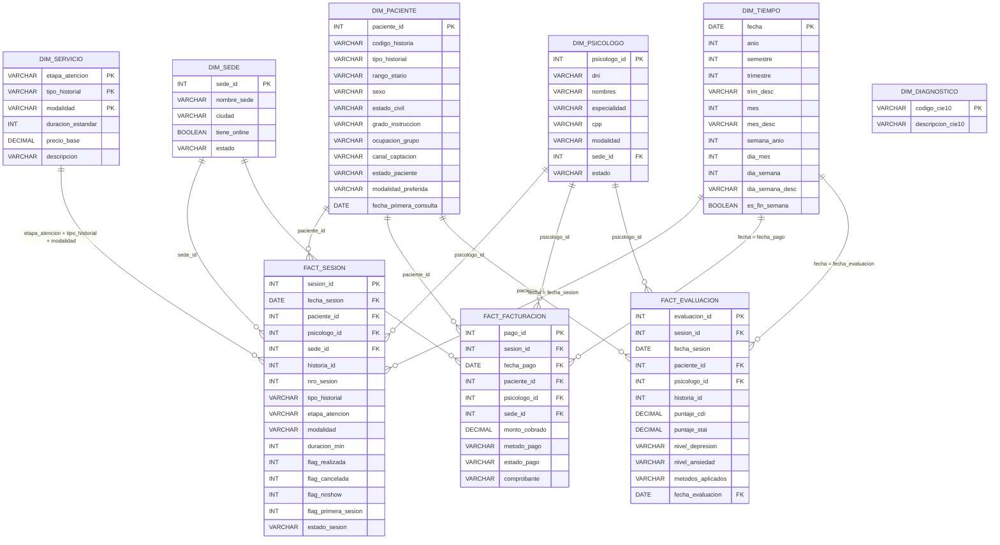

# Modelo dimensional

## Notas de revision

- `dim_servicio` no tiene una clave surrogate en SQL; su relacion con `fact_sesion` se representa por la combinacion natural `etapa_atencion`, `tipo_historial` y `modalidad`.
- `dim_diagnostico` se crea desde `stg_diagnosticos`, pero `fact_evaluacion`, `fact_sesion` y `fact_facturacion` no contienen `codigo_cie10` ni `diagnostico_id`. Por eso queda sin relacion directa en el ER real.
- `fact_facturacion` se filtra a `pg.estado_pago = 'PAGADO'`.
- `fact_evaluacion` contiene `fecha_sesion` y `fecha_evaluacion`; para el vinculo temporal se uso `fecha_evaluacion` porque es el campo temporal declarado en `semantic_models.yml`.
- El README documenta `FACT_Sesion` y `FACT_Facturacion`, pero el codigo dbt real tambien incluye `fact_evaluacion`.
