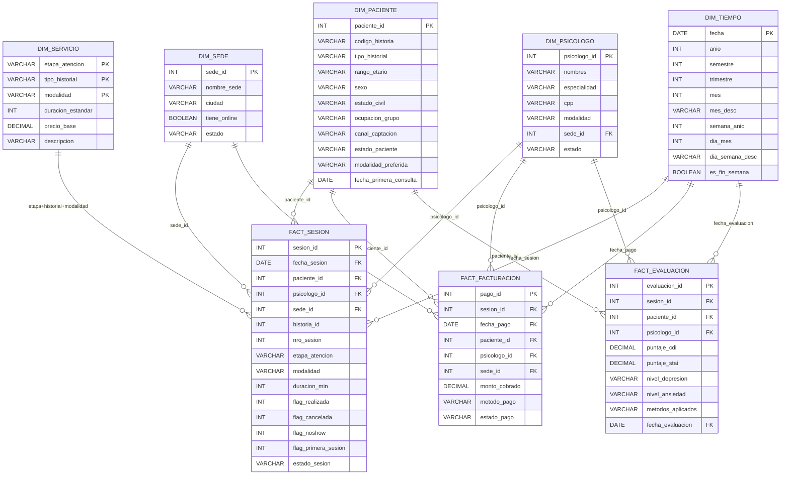
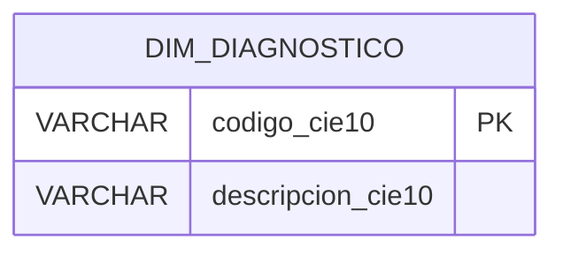

# Modelo dimensional

Diagrama entidad-relacion del datamart construido por dbt en el schema `datamart` de PostgreSQL.

## Esquema estrella — Facts y dimensiones conformadas

## Dimension independiente

!!! warning "DIM_DIAGNOSTICO sin FK en hechos"
    `dim_diagnostico` existe en el datamart pero ninguna de las tres facts contiene `codigo_cie10` ni `diagnostico_id`. Para vincularlo habria que agregar esa FK a `fact_sesion` en los modelos dbt.

---

## Notas de revision

!!! note "Clave compuesta en DIM_SERVICIO"
    `dim_servicio` no tiene surrogate key. Su relacion con `fact_sesion` se establece por la combinacion natural de tres columnas: `etapa_atencion + tipo_historial + modalidad`.

!!! info "Dimensiones conformadas"
    `DIM_PACIENTE`, `DIM_PSICOLOGO`, `DIM_SEDE` y `DIM_TIEMPO` son compartidas por mas de una tabla de hechos, lo que permite analisis cruzado entre sesiones, facturacion y evaluaciones.

!!! tip "Filtro en FACT_FACTURACION"
    `fact_facturacion` solo incluye registros con `estado_pago = 'PAGADO'`. Los pagos pendientes o exonerados quedan excluidos.

## Resumen del esquema estrella

| Tipo | Nombre | Filas (dbt run 2026-05-26) |
|---|---|---|
| Hecho | `fact_sesion` | 52 |
| Hecho | `fact_facturacion` | 45 |
| Hecho | `fact_evaluacion` | 9 |
| Dimension | `dim_paciente` | 20 |
| Dimension | `dim_psicologo` | 4 |
| Dimension | `dim_sede` | 3 |
| Dimension | `dim_tiempo` | 48 fechas |
| Dimension | `dim_servicio` | 22 combinaciones |
| Dimension | `dim_diagnostico` | 10 codigos CIE-10 |
