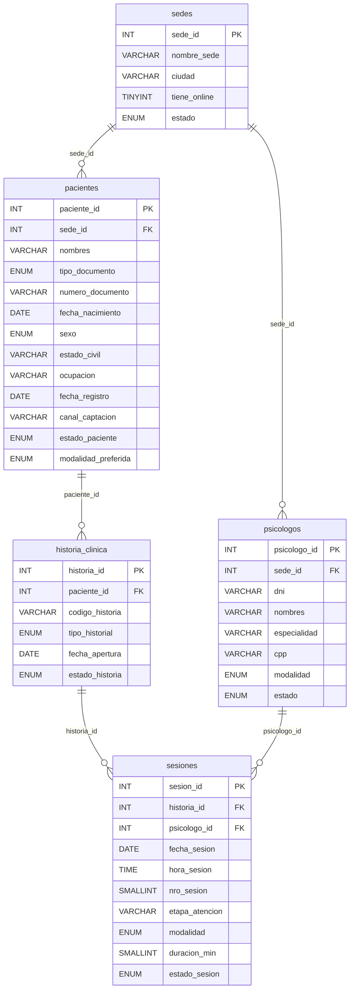
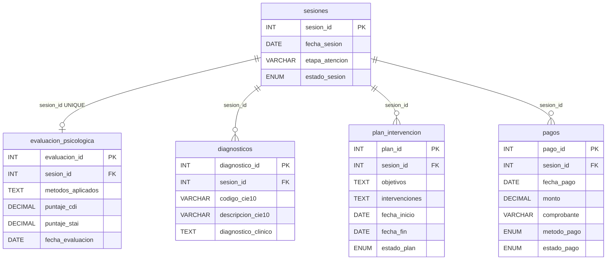

# Esquema OLTP MySQL

Diagrama entidad-relacion del esquema operacional `dm_centro_psicologico` definido en `init.sql` y montado por el `docker-compose.yml` principal.

## Diagrama ER — Jerarquia principal

## Diagrama ER — Tablas dependientes de sesion

---

## Descripcion de tablas

| Tabla | Proposito | PK | FKs |
|---|---|---|---|
| `sedes` | Locaciones fisicas y online del centro | `sede_id` | — |
| `psicologos` | Profesionales registrados | `psicologo_id` | `sede_id → sedes` |
| `pacientes` | Personas en atencion o evaluacion | `paciente_id` | `sede_id → sedes` |
| `historia_clinica` | Expediente clinico de cada paciente | `historia_id` | `paciente_id → pacientes` |
| `sesiones` | Citas individuales o de pareja | `sesion_id` | `historia_id`, `psicologo_id` |
| `evaluacion_psicologica` | Resultados de pruebas aplicadas (1:1 con sesion) | `evaluacion_id` | `sesion_id` (UNIQUE) |
| `diagnosticos` | Codigos CIE-10 asociados a sesiones | `diagnostico_id` | `sesion_id` |
| `plan_intervencion` | Objetivos y tecnicas de tratamiento | `plan_id` | `sesion_id` |
| `pagos` | Transacciones economicas por sesion | `pago_id` | `sesion_id` |

!!! warning "Relacion evaluacion_psicologica"
    `evaluacion_psicologica.sesion_id` tiene restriccion `UNIQUE`, por lo que la relacion es 1:0..1 (una sesion puede tener a lo sumo una evaluacion). Solo se inserta para sesiones con `etapa_atencion = 'EVALUACION'`.

!!! note "Etapas de atencion"
    El campo `etapa_atencion` en `sesiones` clasifica cada cita: `MOTIVO_CONSULTA`, `ANAMNESIS`, `EVALUACION`, `TRATAMIENTO`, `SEGUIMIENTO` o `CIERRE`. Los planes de intervencion solo se crean para sesiones `TRATAMIENTO REALIZADA`.

!!! info "Esquema anterior"
    El archivo `OLTP_Centro_Psicologico.sql` contiene un esquema anterior con tablas prefijadas `oltp_*`. **No es el DDL activo**. El compose principal monta `init.sql`.
