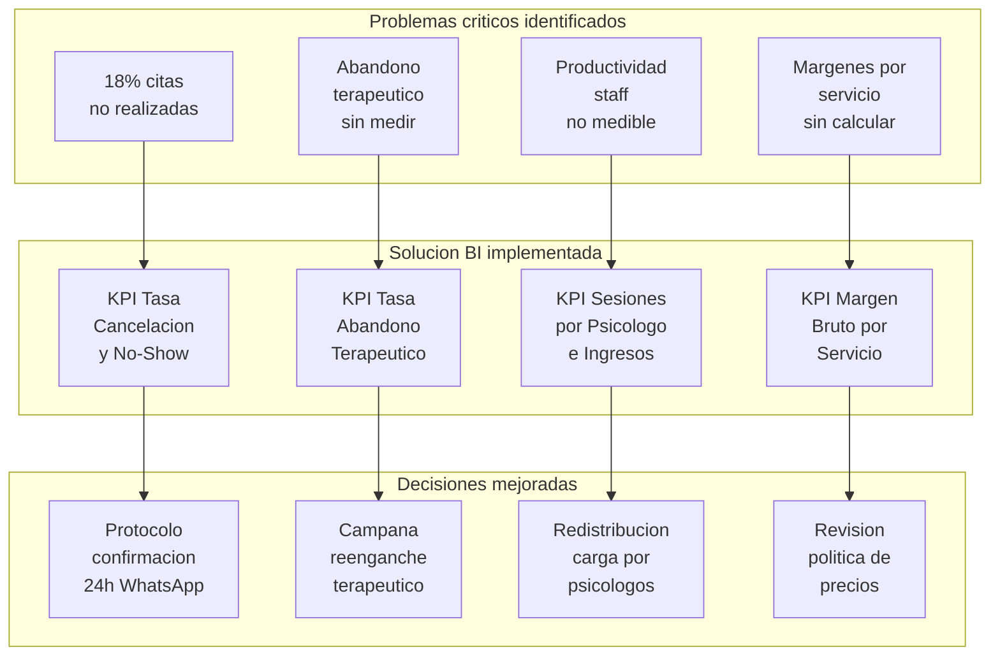

# 3. Problema de Negocio y Objetivo Analitico

El Centro Psicologico Integral Guevara opera con un ecosistema informatico fragmentado donde coexisten registros manuales, hojas de calculo aisladas y un sistema de historia clinica de capacidad analitica limitada. Esta arquitectura descentralizada impide a la direccion correlacionar variables operativas con flujos financieros.

## 3.1 Problema de negocio

| Elemento | Descripcion |
|---|---|
| **Area o proceso involucrado** | Gestion clinica y operativa del Centro Psicologico Integral Guevara: procesos de agendamiento de citas, registro de sesiones terapeuticas, facturacion y cobranza, y seguimiento del estado terapeutico de los pacientes en la sede de Juliaca. |
| **Problema identificado** | El centro opera con un ecosistema informatico fragmentado que combina registros manuales en papel, hojas de calculo aisladas y un sistema de historia clinica de capacidad analitica limitada. Esta fragmentacion impide correlacionar las variables operativas (sesiones, asistencia, carga profesional) con los flujos financieros (facturacion, margenes, ingresos por psicologo), generando cuatro problemas criticos interrelacionados: (1) elevada tasa de abandono terapeutico que reduce el LTV por paciente; (2) aproximadamente el 18% de citas programadas no se realizan por cancelaciones o inasistencias sin aviso; (3) imposibilidad de medir la productividad individual del staff profesional; y (4) ausencia de calculo automatizado de margenes brutos por tipo de servicio. |
| **Usuarios principales** | Gerente General (decisiones estrategicas y financieras), Director Clinico (supervision del equipo terapeutico y calidad de atencion), Area de Administracion y Recepcion (gestion operativa de agenda y cobranza), Area de Marketing y Fidelizacion (captacion y retencion de pacientes), Director Financiero (control de ingresos, costos y margenes). |
| **Decisiones que se buscan mejorar** | (1) Definicion de tarifas y rentabilidad por tipo de servicio psicologico basada en margen bruto real. (2) Redistribucion equilibrada de la carga de atencion entre psicologos segun productividad medida. (3) Implementacion de protocolos de intervencion temprana ante pacientes con riesgo de abandono terapeutico. (4) Optimizacion de horarios y franjas de agenda para reducir la capacidad instalada ociosa generada por no-shows y cancelaciones. |
| **Impacto esperado** | Centralizacion de los datos clinicos, operativos y financieros en un DataMart analitico validado, que permita al equipo directivo monitorear en tiempo cuasi-real los indicadores estrategicos del centro, reducir la tasa de abandono terapeutico del nivel basal detectado hacia una meta sostenible, incrementar la tasa de ocupacion de agenda por encima del 75% mensual, y fundamentar las decisiones de precio y asignacion de recursos en metricas calculadas con trazabilidad completa desde la fuente transaccional. |

## 3.2 Objetivo analitico

El objetivo analitico del proyecto consiste en **disenar, implementar y validar un sistema de Business Intelligence basado en un modelo dimensional de tipo Constelacion** que centralice las metricas operativas, clinicas y financieras del Centro Psicologico Integral Guevara, habilitando la medicion sistematica de indicadores estrategicos y la toma de decisiones basada en evidencia para las audiencias gerencial, clinica y administrativa de la institucion.

## 3.3 Preguntas de negocio

| Pregunta de negocio | KPI relacionado | Usuario | Visual del dashboard |
|---|---|---|---|
| ¿Que servicios psicologicos registran mayor volumen de facturacion y que porcentaje aportan al margen bruto de S/ 8,030? | Margen Bruto por Servicio | Gerente General · Director Financiero | Grafico de barras horizontales por tipo de servicio |
| ¿Cual es la tasa de no-shows y cancelaciones distribuida por psicologo y sede? | Tasa de Cancelacion · Tasa de No-Show | Director Clinico · Administracion | Tabla comparativa con semaforo RAG |
| ¿Que pacientes presentan riesgo de abandono terapeutico segun dias transcurridos desde su ultima sesion? | Tasa de Abandono Terapeutico | Director Clinico · Marketing | Tabla de alertas de pacientes en riesgo |
| ¿Cual es el volumen real de sesiones completadas versus la capacidad disponible del staff? | Tasa de Ocupacion de Agenda | Gerente General · Administracion | Bullet chart de ocupacion vs. meta 75% |

