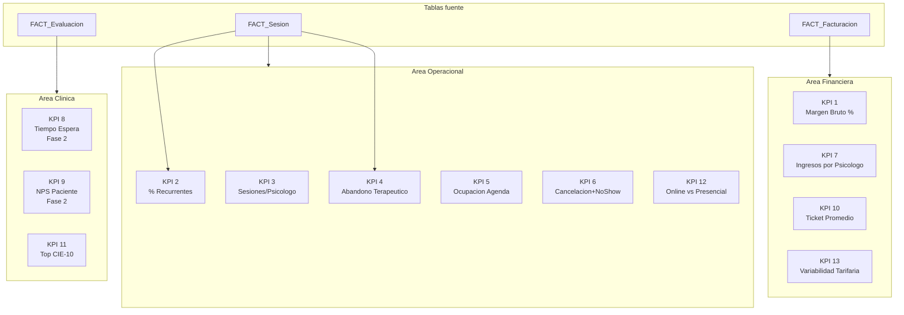

# 4. KPIs Principales

El modelo analitico define **13 KPIs** distribuidos en tres areas: operacional, financiera y clinica. Todos los KPIs tienen trazabilidad directa desde la fuente OLTP hasta la medida DAX en Power BI.

## 4.1 Catalogo de KPIs

| # | KPI | Formula de negocio | Fuente | Frecuencia | Usuario |
|---|---|---|---|---|---|
| 1 | **Margen Bruto por Servicio (%)** | (precio_base - monto_cobrado) / precio_base * 100 | FACT_Facturacion · DIM_Servicio.precio_base | Mensual | Gerente General · Director Financiero |
| 2 | **% Pacientes Recurrentes** | (Pacientes con >1 sesion realizada / Total pacientes unicos) * 100 | FACT_Sesion · DIM_Paciente | Mensual | Director Clinico · Marketing |
| 3 | **Sesiones Atendidas por Psicologo** | COUNT(sesion_id) WHERE flag_realizada = 1, agrupado por psicologo | FACT_Sesion · DIM_Psicologo | Semanal / Mensual | Director Clinico · Administracion |
| 4 | **Tasa de Abandono Terapeutico (%)** | (Pacientes con estado = 'ABANDONO' / Total activos inicio periodo) * 100 | FACT_Sesion · DIM_Paciente.estado_paciente | Mensual | Director Clinico · Gerente General |
| 5 | **Tasa de Ocupacion de Agenda (%)** | (Sesiones realizadas / Total slots agendados habilitados) * 100 | FACT_Sesion · DIM_Psicologo · DIM_Tiempo | Semanal / Mensual | Gerente General · Administracion |
| 6 | **Tasa de Cancelacion y No-Show (%)** | (SUM(flag_cancelada) + SUM(flag_noshow)) / COUNT(sesion_id) * 100 | FACT_Sesion.flag_cancelada · flag_noshow | Semanal | Administracion · Director Clinico |
| 7 | **Ingresos Generados por Psicologo (S/)** | SUM(monto_cobrado) WHERE estado_pago = 'PAGADO', por psicologo | FACT_Facturacion · DIM_Psicologo | Mensual | Gerente General · Director Financiero |
| 8 | **Tiempo Promedio de Espera (dias)** | AVG(fecha_primera_sesion - fecha_solicitud_cita) | No implementado — Fase 2. El OLTP actual no registra fecha de solicitud inicial. | — | Administracion |
| 9 | **NPS del Paciente** | % Promotores (9-10) - % Detractores (0-6) | No implementado — Fase 2. Requiere tabla de encuestas externa. | — | Director Clinico · Marketing |
| 10 | **Ticket Promedio por Paciente (S/)** | SUM(monto_cobrado) / DISTINCTCOUNT(paciente_id) | FACT_Facturacion · DIM_Paciente | Mensual | Director Financiero · Gerente General |
| 11 | **Indice de Diagnosticos de Alta Prevalencia (Top CIE-10)** | COUNT(evaluacion_id) agrupado por codigo_cie10, ordenado DESC | FACT_Evaluacion · DIM_Diagnostico.codigo_cie10 | Mensual | Director Clinico |
| 12 | **Ratio de Sesiones Online vs. Presencial (%)** | (Sesiones con modalidad = 'ONLINE' / Total sesiones realizadas) * 100 | FACT_Sesion · DIM_Servicio.modalidad | Mensual | Gerente General · Director Clinico |
| 13 | **Variabilidad de Ingresos por Tipo de Servicio (S/)** | MAX(monto_cobrado) - MIN(monto_cobrado), por tipo_historial | FACT_Facturacion · DIM_Servicio.tipo_historial | Trimestral | Director Financiero |

!!! info "KPIs 8 y 9 — Fase 2"
    Los KPIs 8 (Tiempo de Espera) y 9 (NPS) no son calculables con el esquema OLTP actual. Se requiere agregar `fecha_solicitud_cita` a `sesiones` y una tabla `encuestas_satisfaccion` en la siguiente version del sistema.

## 4.2 Criterios de interpretacion

| KPI | Bajo | Esperado | Alto / cumplido | Accion sugerida |
|---|---|---|---|---|
| Margen Bruto por Servicio (%) | < 45% | 45% – 52% | > 52% | Revisar estructura de costos directos y politica de honorarios por tipo de servicio psicologico |
| % Pacientes Recurrentes | < 40% | 40% – 50% | > 50% | Activar protocolo de seguimiento post-primera sesion y campana de fidelizacion segmentada por perfil de paciente |
| Sesiones por Psicologo (mes) | < 15 | 15 – 20 | > 20 | Redistribuir carga de pacientes entre profesionales y revisar disponibilidad horaria individual |
| Tasa de Abandono Terapeutico (%) | > 25% | 15% – 25% | <= 15% | Activar campana de reenganche terapeutico; identificar psicologo y etapa clinica con mayor tasa de desercion |
| Tasa de Ocupacion de Agenda (%) | < 60% | 60% – 75% | > 75% | Habilitar lista de espera activa y redistribuir franjas horarias de baja demanda |
| Tasa de Cancelacion y No-Show (%) | > 15% | 8% – 15% | <= 8% | Implementar confirmacion automatica 24h antes por WhatsApp; evaluar politica de penalidad por inasistencia |
| Ingresos por Psicologo (S/) | < S/ 2,500 | S/ 2,500 – S/ 3,000 | > S/ 3,000 | Revisar asignacion de pacientes y mix de servicios atendidos por el profesional |
| Ticket Promedio por Paciente (S/) | < S/ 120 | S/ 120 – S/ 150 | > S/ 150 | Evaluar composicion de servicios ofrecidos y potenciar tipos de servicio con mayor precio base |
| Top CIE-10 — Concentracion diagnostica (%) | > 60% en un diagnostico | 40% – 60% | < 40% en diagnostico principal | Diversificar oferta clinica y evaluar incorporacion de especialistas |
| Ratio Sesiones Online vs. Presencial (%) | < 20% online | 20% – 40% | > 40% | Promover adopcion del canal digital; identificar barreras por rango etario o tipo de servicio |
| Variabilidad Tarifaria por Servicio (S/) | Rango > S/ 200 | S/ 100 – S/ 200 | Rango < S/ 100 | Revisar y estandarizar politica de precios por tipo de plan terapeutico |

## 4.3 Mapa de KPIs por area

