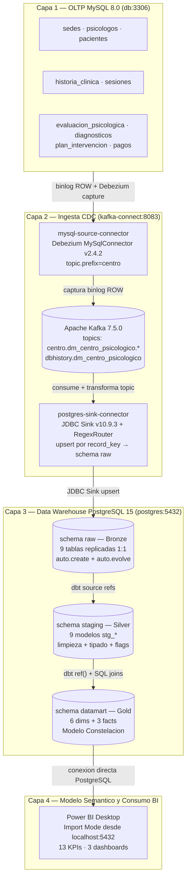
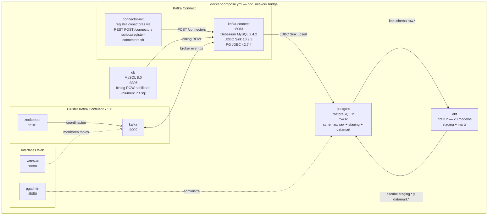

# 5. Arquitectura BI Implementada

La solucion analitica implementa una arquitectura componible y desacoplada basada en el paradigma **Modern Data Stack**, que garantiza el aislamiento fisico total entre el entorno transaccional (OLTP) y el entorno analitico (OLAP) mediante un bus de eventos distribuido. El flujo de datos se procesa de forma continua e incremental a traves de cuatro capas.

## 5.1 Diagrama de arquitectura end-to-end

## 5.2 Descripcion del flujo por capas

**Capa 1 — OLTP (MySQL 8.0):** Almacena las operaciones clinicas en tiempo real: sesiones, pacientes, psicologos, facturacion y evaluaciones. Es la fuente transaccional unica del sistema. El binlog ROW esta habilitado para captura CDC sin intervenir en las tablas operativas.

**Capa 2 — Ingesta CDC (Debezium + Kafka):** Debezium lee el binlog de MySQL sin bloquear las tablas operativas y publica cada cambio (INSERT, UPDATE, DELETE) como un evento en un topic de Apache Kafka. El conector JDBC Sink escribe esos eventos en el schema `raw` de PostgreSQL. El desacoplamiento mediante Kafka garantiza que una falla en el destino no afecte la operacion del centro.

**Capa 3 — Data Warehouse OLAP (PostgreSQL, tres schemas):**

- `raw` (Bronze): zona de aterrizaje con replica directa 1:1 de las 9 tablas OLTP
- `staging` (Silver): modelos dbt que aplican limpieza, tipado explicito, tratamiento de nulos y estandarizacion de nomenclatura
- `datamart` (Gold): materializacion del Modelo Constelacion con 5 dimensiones conformadas, 1 dimension especializada y 3 tablas de hechos

**Capa 4 — Modelo Semantico y BI (Power BI Desktop):** Se conecta al schema datamart en `localhost:5432` mediante Import Mode. Define las relaciones de cardinalidad 1:N, jerarquias analiticas y medidas DAX para los 13 KPIs del proyecto.

## 5.3 Infraestructura Docker

Todos los servicios corren en la red `cdc_network` definida en `docker-compose.yml`.

## 5.4 Componentes implementados

| Componente | Descripcion | Estado | Evidencia |
|---|---|---|---|
| Base Transaccional OLTP | Persistencia relacional de operaciones clinicas, administrativas y financieras | Completo | `init.sql` con DDL y datos; `OLTP_Centro_Psicologico.sql` |
| Ingesta CDC (Debezium + Kafka) | Captura de cambios en tiempo real desde el binlog de MySQL sin bloqueo de tablas | Completo | `connectors/mysql-source.json` y `postgres-sink.json` en estado RUNNING; 10 topics activos en Kafka UI :8080 |
| Broker de Mensajeria (Kafka) | Desacoplamiento fisico entre origen y destino mediante streaming de eventos | Completo | Topics validados en Kafka UI; Kafka Connect operativo en :8083 |
| Capa Raw (PostgreSQL) | Zona de aterrizaje con replica directa 1:1 de las 9 tablas OLTP | Completo | 9 tablas verificadas en schema raw (`\dt raw.*`) |
| Capa Staging (dbt) | Limpieza, tipado explicito, tratamiento de nulos y estandarizacion | Completo | 9 modelos `stg_*` ejecutados; resultado `PASS=20` en dbt run |
| Capa Marts / DataMart (dbt) | Materializacion del Modelo Constelacion: 5 dims conformadas + 3 hechos | Completo | Tablas `DIM_` y `FACT_` verificadas en schema datamart |
| Modelo Semantico (Power BI) | Relaciones 1:N, jerarquias analiticas y 13 KPIs en medidas DAX | Completo | Archivo `.pbix` con panel de relaciones y medidas documentadas |
| Dashboard Interactivo | Tablero Ejecutivo, Tablero Clinico Operativo y Tablero de Fidelizacion | Completo | 3 dashboards desplegados con segmentadores cruzados |
