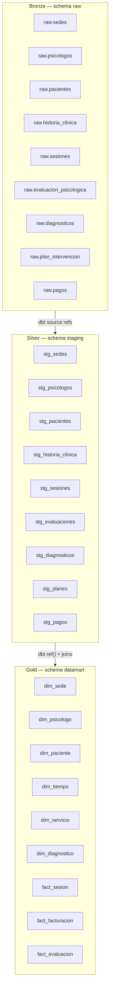

# 7. Pipeline de Ingesta y Transformacion

La solucion implementa una **captura de datos basada en eventos en tiempo real (CDC incremental)**, rompiendo con el paradigma clasico de carga batch programada. Cada cambio registrado en el motor transaccional MySQL (INSERT, UPDATE, DELETE) es capturado por Debezium desde el binlog y transportado hacia PostgreSQL sin bloquear las tablas operativas del centro.

## 7.1 Ingesta CDC — Debezium + Kafka

| Origen MySQL | Destino raw PostgreSQL | Herramienta | Tipo de carga | Estado |
|---|---|---|---|---|
| sesiones | raw.sesiones | Debezium + Apache Kafka | CDC Incremental Streaming | Activo / RUNNING |
| pagos | raw.pagos | Debezium + Apache Kafka | CDC Incremental Streaming | Activo / RUNNING |
| evaluacion_psicologica | raw.evaluacion_psicologica | Debezium + Apache Kafka | CDC Incremental Streaming | Activo / RUNNING |
| pacientes | raw.pacientes | Debezium + Apache Kafka | CDC Incremental Streaming | Activo / RUNNING |
| psicologos | raw.psicologos | Debezium + Apache Kafka | CDC Incremental Streaming | Activo / RUNNING |
| historia_clinica | raw.historia_clinica | Debezium + Apache Kafka | CDC Incremental Streaming | Activo / RUNNING |
| sedes | raw.sedes | Debezium + Apache Kafka | CDC Incremental Streaming | Activo / RUNNING |
| diagnosticos | raw.diagnosticos | Debezium + Apache Kafka | CDC Incremental Streaming | Activo / RUNNING |
| plan_intervencion | raw.plan_intervencion | Debezium + Apache Kafka | CDC Incremental Streaming | Activo / RUNNING |

**Configuracion de los conectores:**

- `mysql-source-connector`: `io.debezium.connector.mysql.MySqlConnector`, `topic.prefix=centro`, `database.include.list=dm_centro_psicologico`, `snapshot.mode=initial`
- `postgres-sink-connector`: `io.confluent.connect.jdbc.JdbcSinkConnector`, `insert.mode=upsert`, `pk.mode=record_key`, `auto.create=true`, `auto.evolve=true`
- **RegexRouter** transforma los topics `centro.dm_centro_psicologico.<tabla>` → nombre de tabla en schema `raw`

## 7.2 Capas de datos



| Capa | Equivalencia | Proposito |
|---|---|---|
| `raw` | Bronze | Zona de aterrizaje directo. Almacena replicas exactas inyectadas por el Kafka Sink Connector sin transformaciones. Estructura append-only que garantiza linaje completo del dato desde el origen. |
| `staging` | Silver | Capa de preparacion orquestada por dbt. Aplica transformaciones atomicas: renombrado de campos, tipado explicito (CAST), control de nulos (COALESCE) y conversion de estados a flags booleanos. |
| `datamart (marts)` | Gold | Capa de entrega final estructurada bajo el Modelo Constelacion. Contiene 6 dimensiones conformadas y 3 tablas de hechos optimizadas para consultas analiticas desde Power BI en Import Mode. |

## 7.3 Modelos de transformacion dbt

El proyecto dbt materializa **20 modelos** distribuidos en tres capas logicas.

### Modelos Staging (9 modelos)

| Modelo | Fuente | Transformacion aplicada | Resultado |
|---|---|---|---|
| `stg_sedes.sql` | raw.sedes | Convierte `tiene_online` TINYINT → booleano | Vista estandarizada del catalogo de sedes |
| `stg_psicologos.sql` | raw.psicologos | Estandarizacion de `nombre_completo`; filtrado `estado != 'INACTIVO'` | Vista del staff profesional activo con nomenclatura unificada |
| `stg_pacientes.sql` | raw.pacientes | `DATE '1970-01-01' + fecha_nacimiento` (entero Debezium → DATE); clasificacion de `rango_etario` con CASE WHEN | Vista de pacientes con segmentacion demografica homogeneizada |
| `stg_historia_clinica.sql` | raw.historia_clinica | Convierte `fecha_apertura`; estandariza `tipo_historial` | Expediente clinico con tipos y fechas validadas |
| `stg_sesiones.sql` | raw.sesiones | Convierte `fecha_sesion`; `COALESCE(duracion_min, 0)`; mapea `estado_sesion` → flags booleanos `flag_realizada`, `flag_cancelada`, `flag_noshow`; identifica `flag_primera_sesion` cuando `nro_sesion = 1` | Vista estandarizada de sesiones con flags listos para agregacion |
| `stg_evaluaciones.sql` | raw.evaluacion_psicologica | `COALESCE` en `puntaje_cdi`/`puntaje_stai`; convierte `fecha_evaluacion`; estandariza `paciente_id` para join | Vista de evaluaciones clinicas con fechas normalizadas |
| `stg_diagnosticos.sql` | raw.diagnosticos | Estandariza `codigo_cie10` a formato alfanumerico controlado; filtra `codigo_cie10 IS NOT NULL` | Vista del maestro CIE-10 homologado |
| `stg_planes.sql` | raw.plan_intervencion | Castea `costo_total` y `cobertura_sesiones` a tipos numericos; convierte `fecha_inicio`/`fecha_fin` | Vista de planes terapeuticos con tipos financieros validados |
| `stg_pagos.sql` | raw.pagos | Convierte `fecha_pago`; `COALESCE(monto, 0.00)`; convierte tipos texto → DECIMAL(10,2) | Vista de transacciones economicas con tipos de dato validados |

### Modelo Intermedio (1 modelo ephemeral)

| Modelo | Fuente | Transformacion | Resultado |
|---|---|---|---|
| `int_sesiones_facturadas.sql` | stg_sesiones + stg_pagos | INNER JOIN entre sesiones y pagos por `sesion_id`. Aislamiento de transacciones huerfanas. **No genera tabla fisica** | Join limpio de sesiones con su correspondiente facturacion, sin registros huerfanos |

### Modelos Marts — Dimensiones (6 modelos)

| Modelo | Fuente | Descripcion | Filas |
|---|---|---|---|
| `dim_paciente.sql` | stg_pacientes | Consolidacion de atributos maestros del paciente; persistencia del ultimo `estado_paciente` | 100 |
| `dim_psicologo.sql` | stg_psicologos | Estructuracion jerarquica del staff profesional activo; indexacion por especialidad | 6 |
| `dim_sede.sql` | stg_sedes | Catalogo geografico normalizado; segmentacion regional en Juliaca | 2 |
| `dim_servicio.sql` | stg_sesiones + stg_historia_clinica | DISTINCT sobre `etapa_atencion + tipo_historial + modalidad` | 8+ combinaciones |
| `dim_tiempo.sql` | Generacion analitica pura (macro dbt) | Vector de fechas continuo; campos derivados: anio, semestre, trimestre, mes, semana, dia_semana, flag_fin_semana. Rango 2024–2026 | 1,096 fechas |
| `dim_diagnostico.sql` | stg_diagnosticos | Maestro dimensional homologado con CIE-10; DISTINCT por codigo | 15 codigos CIE-10 |

### Modelos Marts — Hechos (3 modelos)

| Modelo | Fuente | Descripcion | Filas |
|---|---|---|---|
| `fact_sesion.sql` | int_sesiones_facturadas + dims | Materializacion incremental de transacciones clinicas vinculadas a 5 dimensiones conformadas mediante surrogate keys | 71+ sesiones |
| `fact_facturacion.sql` | stg_pagos + dims | Materializacion incremental de metricas financieras; filtro `estado_pago = 'PAGADO'` | 71 pagos cobrados |
| `fact_evaluacion.sql` | stg_evaluaciones + dim_diagnostico | Consolidacion de evaluaciones de salud mental vinculadas a DIM_Diagnostico via `codigo_cie10` | 15+ evaluaciones |

## 7.4 Evidencia de ejecucion

| Evidencia | Descripcion | Estado |
|---|---|---|
| Ejecucion de `dbt run` | 20 modelos ejecutados con resultado `PASS=20 WARN=0 ERROR=0` | Completo — ver `dbt/target/run_results.json` |
| Tablas creadas en raw | 9 tablas replicadas desde MySQL en el schema raw de PostgreSQL | Completo — `\dt raw.*` |
| Modelos staging compilados | 9 modelos `stg_*` con transformaciones de limpieza aplicadas | Completo |
| Modelo intermediate ephemeral | `int_sesiones_facturadas` — join limpio sin tabla fisica | Completo |
| Modelos creados en datamart | 6 dims + 3 facts verificados en schema datamart | Completo — `\dt datamart.*` |
| Topics activos en Kafka UI | 10 topics CDC activos en Kafka UI (:8080) — estado RUNNING | Completo |

```bash
# Comando para ejecutar el pipeline completo
docker compose run --rm dbt dbt run --profiles-dir /dbt --project-dir /dbt

# Resultado esperado
# PASS=20  WARN=0  ERROR=0  SKIP=0  TOTAL=20
```
