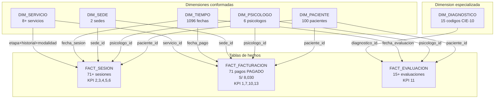

# 8. Data Warehouse y DataMart

## 8.1 Modelo dimensional

El DataMart implementa un **Modelo Constelacion** con tres tablas de hechos que comparten dimensiones conformadas.

**Grano de las tablas de hechos:**

- `FACT_Sesion`: una fila representa una sesion terapeutica programada en el centro
- `FACT_Facturacion`: una fila representa un comprobante de pago emitido y conciliado en caja
- `FACT_Evaluacion`: una fila representa una evaluacion psicologica aplicada a un paciente *(factless fact table — su valor analitico principal es el conteo de eventos diagnosticos por codigo CIE-10)*

**Dimensiones implementadas:** DIM_Paciente, DIM_Psicologo, DIM_Servicio, DIM_Sede, DIM_Tiempo (conformadas) y DIM_Diagnostico (especializada, vinculada exclusivamente a FACT_Evaluacion).

## 8.2 Diagrama del modelo

Ver [Modelo Dimensional](../diagrams/modelo_dimensional.md) para el diagrama ER completo del schema datamart.

## 8.3 Resumen del esquema estrella

| Tipo | Tabla | Filas | KPI soportado |
|---|---|---|---|
| Hecho | `fact_sesion` | 71+ | KPI 2, 3, 4, 5, 6, 12 |
| Hecho | `fact_facturacion` | 71 | KPI 1, 7, 10, 13 |
| Hecho | `fact_evaluacion` | 15+ | KPI 11 |
| Dimension | `dim_paciente` | 100 | KPI 2, 4, 10 |
| Dimension | `dim_psicologo` | 6 | KPI 3, 7 |
| Dimension | `dim_sede` | 2 | KPI 5, 6 |
| Dimension | `dim_tiempo` | 1,096 fechas | Todos los KPIs con filtro temporal |
| Dimension | `dim_servicio` | 8+ combinaciones | KPI 1, 12, 13 |
| Dimension | `dim_diagnostico` | 15 codigos CIE-10 | KPI 11 |

## 8.4 Reglas de negocio aplicadas

| Regla | Tabla / campo | Descripcion | KPI afectado |
|---|---|---|---|
| Conversion de estado clinico a flags booleanos | FACT_Sesion: flag_realizada, flag_cancelada, flag_noshow | El campo texto `estado_sesion` de sesiones se descompone en tres flags numericos (0/1) mediante CASE WHEN en `stg_sesiones.sql`, habilitando agregaciones aditivas directas sin logica condicional en Power BI | KPI 3, 4, 5, 6 |
| Tratamiento de nulos en metricas financieras | FACT_Facturacion: monto_cobrado | Se aplica `COALESCE(monto, 0.0)` en `stg_pagos.sql` para evitar que registros con pago pendiente propaguen valores NULL en las sumas del DataMart | KPI 1, 7, 10, 13 |
| Estandarizacion del dominio de modalidad | DIM_Servicio: modalidad | El atributo modalidad se normaliza a valores controlados ('ONLINE', 'PRESENCIAL') en staging, eliminando variantes textuales del OLTP | KPI 12 |
| Dimension temporal generada analiticamente | DIM_Tiempo | Vector de fechas generado programaticamente por macro dbt sin dependencia del OLTP, garantizando densidad completa del calendario y ausencia de fechas faltantes en series temporales | Todos los KPIs con filtro temporal |
| Aislamiento de transacciones huerfanas | int_sesiones_facturadas (ephemeral) | INNER JOIN entre stg_sesiones y stg_pagos por sesion_id en modelo ephemeral antes de la materializacion final, eliminando sesiones sin pago y pagos sin sesion | KPI 1, 7 |
| Vinculacion epidemiologica mediante CIE-10 | FACT_Evaluacion: diagnostico_id | FACT_Evaluacion se conecta exclusivamente a DIM_Diagnostico, dimension no compartida con las otras tablas de hechos, aislando el proceso diagnostico del proceso financiero y operativo | KPI 11 |
| Clave compuesta en DIM_SERVICIO | DIM_Servicio: etapa_atencion + tipo_historial + modalidad | dim_servicio no tiene surrogate key. Su relacion con fact_sesion se establece por la combinacion natural de tres columnas | KPI 5, 12 |
| Filtro de pagos en FACT_FACTURACION | FACT_Facturacion: estado_pago | fact_facturacion solo incluye registros con `estado_pago = 'PAGADO'`. Los pagos pendientes o exonerados quedan excluidos del total de ingresos | KPI 1, 7, 10 |
