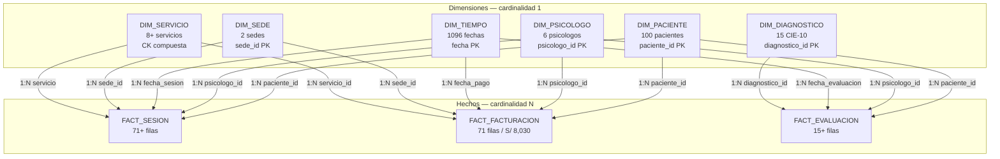

# 9. Modelo Semantico en Power BI

El modelo semantico en Power BI Desktop se conecta directamente al schema `datamart` de PostgreSQL en `localhost:5432` mediante **Import Mode**. Define 13 relaciones entre tablas, jerarquias analiticas y 13 KPIs implementados como medidas DAX.

## 9.1 Relaciones del modelo

| Tabla dimension | Tabla hecho | Campo dimension | Campo hecho | Cardinalidad | Dir. filtro |
|---|---|---|---|---|---|
| DIM_Tiempo | FACT_Sesion | fecha | fecha_sesion | 1:N | Unica (Dim → Hecho) |
| DIM_Tiempo | FACT_Facturacion | fecha | fecha_pago | 1:N | Unica (Dim → Hecho) |
| DIM_Tiempo | FACT_Evaluacion | fecha | fecha_evaluacion | 1:N | Unica (Dim → Hecho) |
| DIM_Paciente | FACT_Sesion | paciente_id | paciente_id | 1:N | Unica (Dim → Hecho) |
| DIM_Paciente | FACT_Facturacion | paciente_id | paciente_id | 1:N | Unica (Dim → Hecho) |
| DIM_Paciente | FACT_Evaluacion | paciente_id | paciente_id | 1:N | Unica (Dim → Hecho) |
| DIM_Psicologo | FACT_Sesion | psicologo_id | psicologo_id | 1:N | Unica (Dim → Hecho) |
| DIM_Psicologo | FACT_Facturacion | psicologo_id | psicologo_id | 1:N | Unica (Dim → Hecho) |
| DIM_Psicologo | FACT_Evaluacion | psicologo_id | psicologo_id | 1:N | Unica (Dim → Hecho) |
| DIM_Servicio | FACT_Sesion | etapa+historial+modalidad | etapa+historial+modalidad | 1:N | Unica (Dim → Hecho) |
| DIM_Servicio | FACT_Facturacion | servicio_id | servicio_id | 1:N | Unica (Dim → Hecho) |
| DIM_Sede | FACT_Sesion | sede_id | sede_id | 1:N | Unica (Dim → Hecho) |
| DIM_Diagnostico | FACT_Evaluacion | diagnostico_id | diagnostico_id | 1:N | Unica (Dim → Hecho) |

## 9.2 Medidas DAX

```dax
-- KPI base operativo
Total Sesiones Atendidas =
CALCULATE(COUNTROWS('fact_sesion'), 'fact_sesion'[flag_realizada] = 1)

-- KPI 1: Margen Bruto %
Margen Bruto % =
VAR IngresosTotales = SUM('fact_facturacion'[monto_cobrado])
VAR CostoBaseTeorico = SUM('fact_facturacion'[precio_base])
RETURN DIVIDE(IngresosTotales - CostoBaseTeorico, IngresosTotales, 0) * 100

-- KPI 2: % Pacientes Recurrentes
Pacientes Recurrentes % =
VAR PacientesConMasDeUnaSesion =
    COUNTROWS(FILTER(VALUES('fact_sesion'[paciente_id]),
        CALCULATE(COUNTROWS('fact_sesion'), 'fact_sesion'[flag_realizada] = 1) > 1))
VAR TotalPacientesAtendidos = DISTINCTCOUNT('fact_sesion'[paciente_id])
RETURN DIVIDE(PacientesConMasDeUnaSesion, TotalPacientesAtendidos, 0) * 100

-- KPI 4: Tasa Abandono Terapeutico %
Tasa Abandono % =
VAR PacientesEnAbandono =
    CALCULATE(DISTINCTCOUNT('dim_paciente'[paciente_id]),
        'dim_paciente'[estado_paciente] = "ABANDONO")
VAR TotalPacientesHistoricos = DISTINCTCOUNT('dim_paciente'[paciente_id])
RETURN DIVIDE(PacientesEnAbandono, TotalPacientesHistoricos, 0) * 100

-- KPI 6: Tasa Cancelacion y NoShow %
Tasa Cancelacion y NoShow % =
VAR TotalNoRealizadas = SUM('fact_sesion'[flag_cancelada]) + SUM('fact_sesion'[flag_noshow])
VAR TotalAgendadas = COUNTROWS('fact_sesion')
RETURN DIVIDE(TotalNoRealizadas, TotalAgendadas, 0) * 100

-- KPI 7: Ingresos por Psicologo
Monto Total Cobrado = SUM('fact_facturacion'[monto_cobrado])

-- KPI 10: Ticket Promedio por Paciente
Ticket Promedio x Paciente =
DIVIDE([Monto Total Cobrado], DISTINCTCOUNT('fact_facturacion'[paciente_id]), 0)
```

| Medida | Formato | KPI asociado |
|---|---|---|
| Total Sesiones Atendidas | Entero | Metrica base operativa |
| Margen Bruto % | Porcentaje | KPI 1 |
| Pacientes Recurrentes % | Porcentaje | KPI 2 |
| Sesiones por Psicologo | Entero | KPI 3 |
| Tasa Abandono % | Porcentaje | KPI 4 |
| Tasa Ocupacion Agenda % | Porcentaje | KPI 5 |
| Tasa Cancelacion y NoShow % | Porcentaje | KPI 6 |
| Monto Total Cobrado | Moneda S/ | KPI 7 |
| Ticket Promedio x Paciente | Moneda S/ | KPI 10 |
| Indice Top CIE-10 | Entero | KPI 11 |
| Ratio Sesiones Online % | Porcentaje | KPI 12 |
| Variabilidad Tarifaria | Moneda S/ | KPI 13 |

## 9.3 Jerarquias y campos de analisis

| Jerarquia | Niveles | Tabla | Uso analitico |
|---|---|---|---|
| Jerarquia_Tiempo | Año → Trimestre → Nombre_Mes → Dia | DIM_Tiempo | Drill-Down temporal en graficos de tendencia de sesiones, ingresos y cancelaciones por periodo |
| Jerarquia_Sedes | Ciudad → Nombre_Sede | DIM_Sede | Segmentacion geografica de indicadores operativos y financieros entre Sede Fisica Juliaca y Sede Virtual |
| Jerarquia_Psicologo | Especialidad → Psicologo | DIM_Psicologo | Analisis de productividad y carga de atencion por especialidad y profesional |
| Jerarquia_Paciente | Rango_Etario → Paciente | DIM_Paciente | Segmentacion demografica de recurrencia y abandono |

## 9.4 Diagrama de relaciones Power BI


