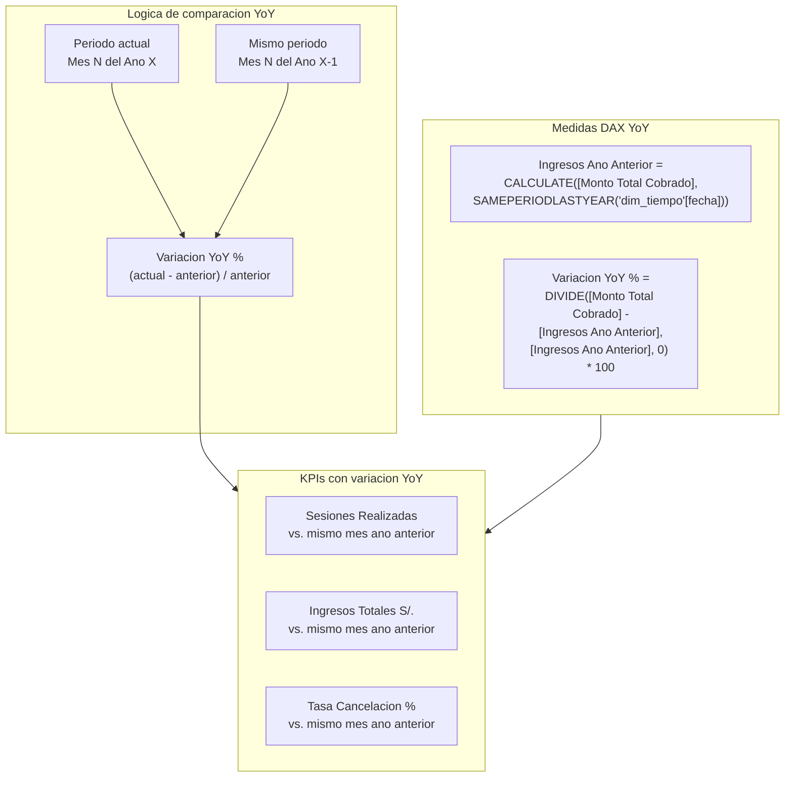
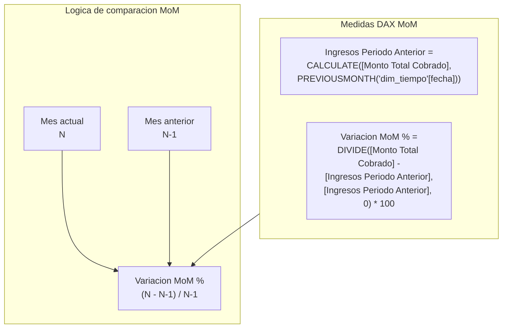
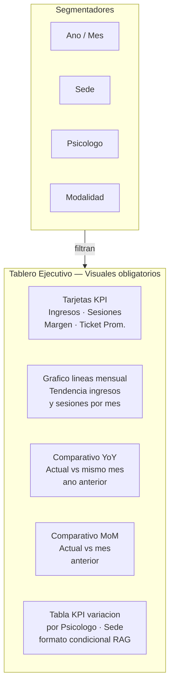

# 10. Dashboard Interactivo

El dashboard interactivo esta implementado en **Power BI Desktop** con tres tableros ejecutivos y un reporte de pacientes. Cada pagina tiene KPIs, visuales especificos y segmentadores cruzados que permiten analisis por periodo, sede, psicologo y modalidad.

## 10.1 Paginas del dashboard

| Pagina | Objetivo | Visuales principales | Filtros |
|---|---|---|---|
| **Tablero Ejecutivo** | Mostrar KPIs financieros y operativos globales | Tarjetas (ingresos, sesiones, margen), grafico de lineas mensual, barras por psicologo | Periodo, sede |
| **Tablero Clinico Operativo** | Analizar tasa de cancelacion, no-show y ocupacion | Tabla con semaforo RAG, bullet chart ocupacion vs. meta 75%, grafico de barras por psicologo | Periodo, psicologo, etapa atencion |
| **Tablero de Fidelizacion** | Identificar pacientes en riesgo de abandono | Tabla de alertas, grafico de recurrencia, mapa de calor por etapa terapeutica | Estado paciente, canal captacion, rango etario |
| **Reporte de Pacientes** | Analizar distribucion demografica y comportamiento | Grafico de dona por rango etario, ranking por psicologo, tabla detalle pacientes | Modalidad, sexo, sede |

## 10.2 Interactividad implementada

| Funcionalidad | Pagina / visual | Proposito |
|---|---|---|
| Segmentadores cruzados | Todas las paginas | Filtros sincronizados por periodo, sede, psicologo y modalidad para analisis multidimensional |
| Drill-down temporal | Graficos de tendencia | Navegacion Año → Trimestre → Mes → Semana en cualquier visual con eje de tiempo |
| Drill-through | Pagina de pacientes | Desde resumen de psicologo → detalle de sesiones y pagos del profesional seleccionado |
| Tooltips personalizados | KPIs tipo tarjeta | Al pasar el cursor muestra formula del KPI y comparativo vs periodo anterior |
| Navegacion entre paginas | Botones de menu | Navegacion sin perder el contexto del filtro activo |

## 10.3 Comparativos y KPIs obligatorios

El dashboard incluye los tres comparativos obligatorios del curso:

### Comparativo vs mismo periodo ano anterior (YoY)

### Comparativo vs periodo anterior (MoM)

### Tabla KPI de variacion por dimension de negocio

| KPI | Valor actual | Ano anterior | Variacion % | Dimension |
|---|---|---|---|---|
| Sesiones realizadas | 71 | — | — | por Psicologo / Sede |
| Ingresos Totales S/ | S/ 8,030 | — | — | por Sede / Metodo Pago |
| Tasa Cancelacion % | ~13% | — | — | por Psicologo |
| Margen Bruto % | 49.94% | — | — | por Tipo de Servicio |
| Ticket Promedio S/ | ~S/ 113 | — | — | por Canal Captacion |
| Abandono Terapeutico % | — | — | — | por Psicologo / Etapa |

!!! tip "Iconos de semaforo RAG"
    Los visuales de comparativo usan formato condicional con iconos: verde (cumplido), amarillo (en rango esperado), rojo (bajo). Los umbrales son los definidos en la seccion de [criterios de interpretacion de KPIs](04_kpis.md#42-criterios-de-interpretacion).

## 10.4 Estructura de visuales obligatorios

